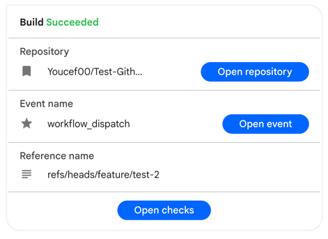
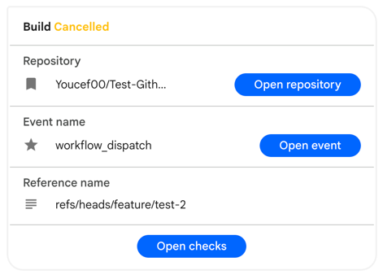
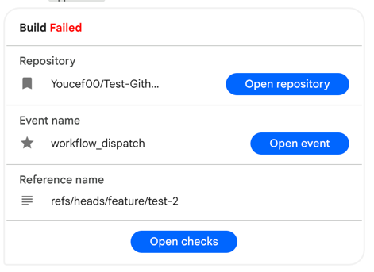

# Google Chat Notification for GitHub Actions


This action sends a notification of your GitHub job status to your Google Chat Space.




## Usage
### Parameters
|  Name  | Required | Description                                                                                                |
|:------:|:--------:|:-----------------------------------------------------------------------------------------------------------|
|  name  |   true   | Job name. Used for notification titles.                                                                    |
|  url   |   true   | Google Chat Webhook URL.                                                                                   |
| status |   true   | Job status. Available values are `success`, `failure`, `cancelled`. We recommend using `${{ job.status }}` |

### Examples
```yaml
- name: Google Chat Notification
  uses: Youcef00/google-chat-notification@v1.0.0
  with:
    name: Build
    url: ${{ secrets.GOOGLE_CHAT_WEBHOOK }}
    status: ${{ job.status }}
```

This repository is generated by [typescript-action](https://github.com/actions/typescript-action).